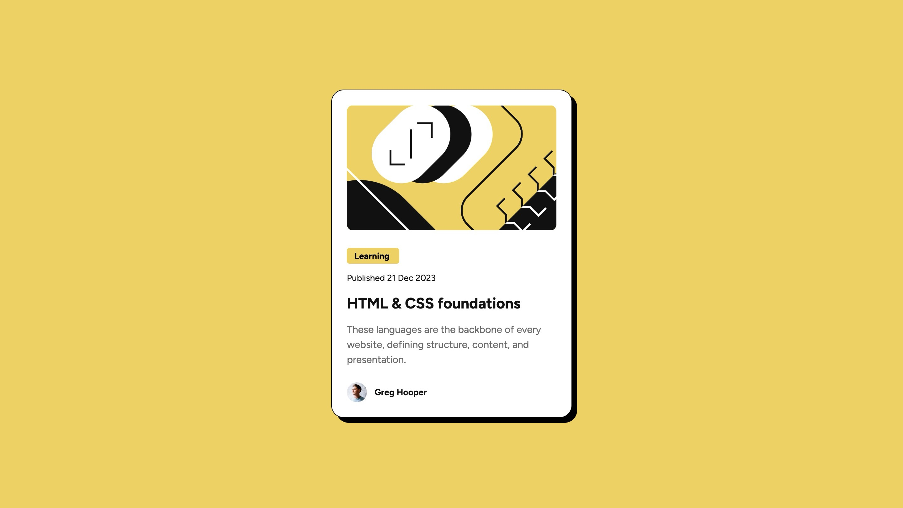
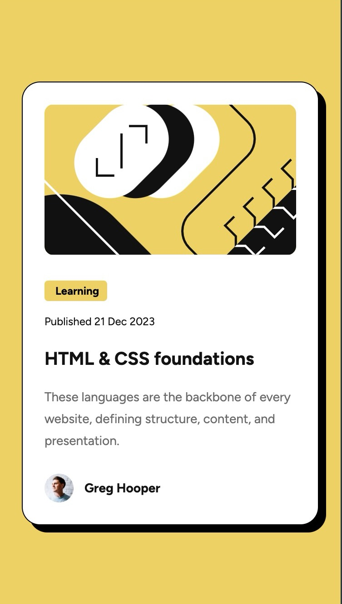

# Frontend Mentor - Blog preview card solution

[Blog preview card Solution](https://www.frontendmentor.io/challenges/blog-preview-card-ckPaj01IcS)

## Overview

### Links

- [Solution](https://github.com/Lokesh8055/blog-preview-card)
- [LiveSite](https://blog-preview-lp.netlify.app)

### Screenshot




## My process

### Built with

- Semantic HTML5 markup
- CSS custom properties, BEM convention
- FlexBox
- Mobile-first workflow

### What I learned

Learned about boxShadow property and how i can reuse styles

```css
box-shadow: 8px 8px 0px 0px var(--black);
```

### Continued development

Will continue my focus on responsive web design principles

## Author

- Frontend Mentor - [@Lokesh8055](https://www.frontendmentor.io/profile/Lokesh8055)
